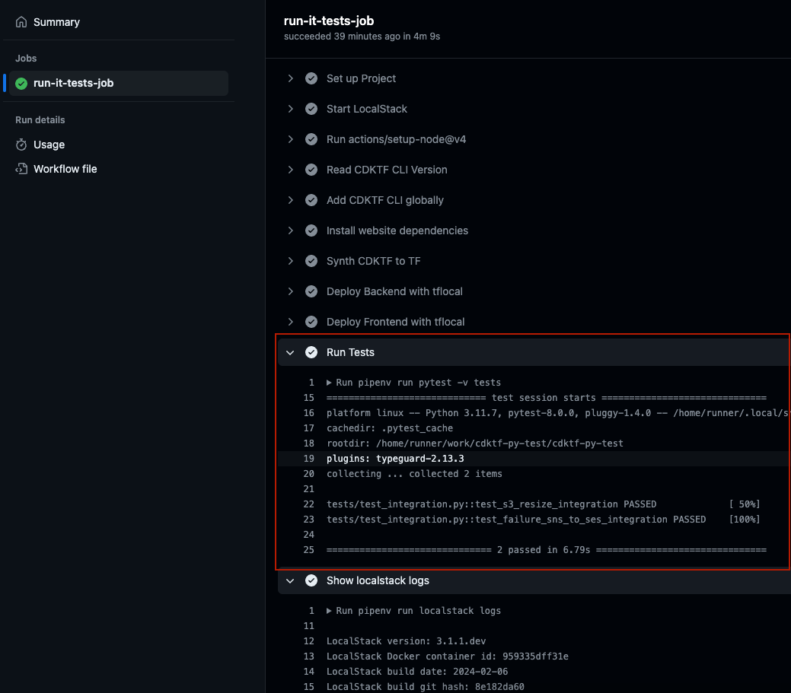

# CDKTF LocalStack quickstart

In this assignment we will focus on:

- AWS Services (without requiring an AWS Account)
- CDK for Terraform (Python)
- GitHub Workflow Integration test

## Overview

Implement [Localstack: Quickstart](https://docs.localstack.cloud/getting-started/quickstart/) in CDKTF.


## Pre-req

Please make sure that you have the following working on your machine:

- NodeJS installation
- Python3 / [pipenv](https://pipenv.pypa.io/en/latest/#install-pipenv-today)
- Docker environment
- Terraform (i.e. managed through [tfenv](https://github.com/tfutils/tfenv))
- [AWS cli](https://docs.aws.amazon.com/cli/latest/userguide/getting-started-install.html#getting-started-install-instructions) only (we will use localstack so no aws credentials required)
- utilities `jq`, `zip` & `curl`

See also this CDKTF and Localstack getting started guides:

- [cdktf python example](https://github.com/cdktf/cdktf-integration-serverless-python-example/blob/main/README.md)

## Set up

MacOS tips

```console
which python3
which docker
pip3 install --user pipenv
# Ensure pipenv is on path, or else.. add
export PATH=/Users/${USER}/Library/Python/3.11/bin:$PATH
```

Ensure CDKTF CLI is set up

```console
npm i -g cdktf-cli@0.20.3
```

## Explore Env

```console
pipenv shell
```

```console
DEBUG=1 EXTRA_CORS_ALLOWED_ORIGINS=* localstack start -d

# check status
localstack status
```

> Note: To see SNS Emails, should be able to use DATA_DIR [see: issue comment](https://github.com/localstack/localstack/issues/2682#issuecomment-992701277).

## Assignment

This repo has been modified to be deployed using IaC with CDKTF. The ultimate goal is to make the GH Workflow pass.

The exact shell commands to achieve a working configuration are in [deploy.sh](https://github.com/localstack-samples/sample-serverless-image-resizer-s3-lambda/blob/09ff2b2529b8a56984a72eda17f071460f4c1af6/bin/deploy.sh)

However, you may only run `cdktf` commands in GH Runner to achieve the working configuration.

## Backend stack

### Backend Overview

- `images` and `resized` S3 buckets
- `list`, `presign` and `resize` Lambda Functions
- S3 bucket event trigger for `resize` Lambda Function

### Backend Todo

- [ ] Create S3 buckets
- [ ] Create SSM Paramaters for Lambda handlers to work
- [ ] Create SNS Topic to receive dead letter notifications when resize lambda fails
- [ ] Create resize lambda
- [ ] Create images bucket event trigger for resize lambda

### Backend deploy

> Run in `pipenv shell`

```console
cdktf synth
TERRAFORM_BINARY_NAME=tflocal cdktf apply iac-assignment-backend
```

> You may use `--skip-synth` to speed up apply.

## Frontend stack

### Frontend Overview

- `webapp` S3 bucket
- `.env.local` file with Env config

### Frontend Todo

- [ ] Create S3 bucket for webapp
- [ ] Create webapp S3 Bucket website configuration and s3 policy

### Frontend Deploy

> Run in `pipenv shell`

```console
TERRAFORM_BINARY_NAME=tflocal cdktf apply iac-assignment-frontend
```

Copy `website` to `webapp` S3 Bucket (uses `website/.env.local` config from `cdktf apply`):

```console
npm --prefix website install
npm --prefix website run deploy
```

## Integration test

> Run in `pipenv shell`

```console
pytest tests/
```

### Testing Todo

Make the [GitHub Workflow](.github/workflows/pr.yaml) pass

- [ ] Set up CDKTF cli in GitHub Runner
- [ ] Deploy Backend with CDKTF
- [ ] Deploy Frontend with CDKTF



### Testing Bonus points

[Terraform Unit Test docs](https://developer.hashicorp.com/terraform/cdktf/test/unit-tests)

- [ ] Refactor IaC to split backend and frontend stacks in separate code files
- [ ] Implement CDKTF Unit tests in [main-test.py](./main-test.py)
- [ ] Implement Unit tests for `list`, `presign` and `resize` functions
- [ ] Run Unit tests in pre-commit

## Debug Tips

LocalStack debug logs show lambda invocations and logs:

```console
localstack logs -f
```

To check resize dead letter notifications:

```console
curl -s http://localhost:4566/_aws/ses | jq -r '.messages[0] | {Destination, "Message": (.Body.text_part | fromjson)}' 
```
